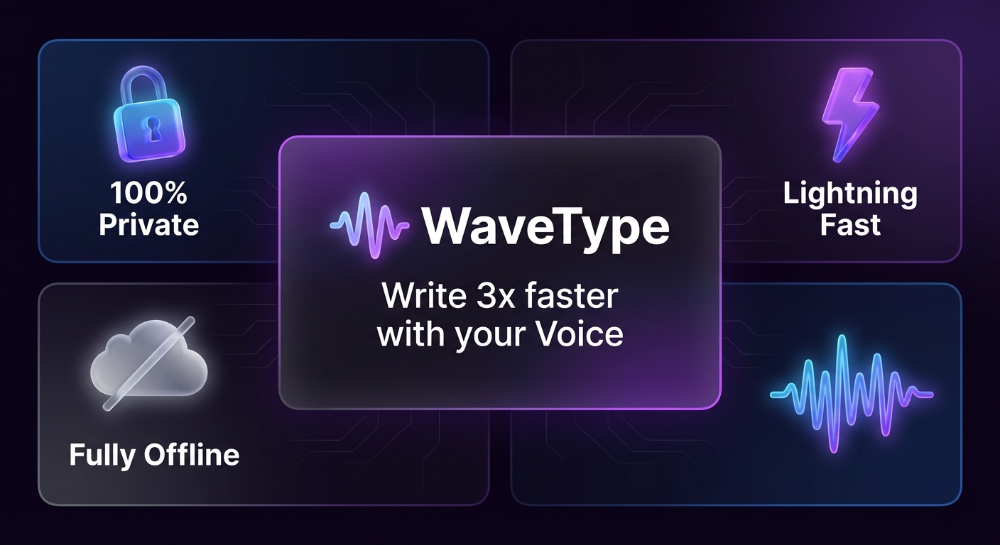

# Wavee



**Wave your voice. Get text at your cursor.**

Wavee is a calm, local-first dictation layer for Windows and macOS. Hold a hotkey, speak naturally, and Wavee turns your voice into polished text right where your cursor is.

[Download Latest Release](https://github.com/johuniq/wavee/releases/latest) · [Report A Bug](https://github.com/johuniq/wavee/issues/new?template=bug_report.yml) · [Contribute](CONTRIBUTING.md)

## Why Wavee

- **Text at your cursor**: speak once and place the result into the app you are already using.
- **Local by default**: audio is processed on your device.
- **Fast dictation**: hold a hotkey, talk through the thought, and keep moving.
- **Works with files**: turn common audio formats into clean text when you are not recording live.
- **Built for real writing**: optional cleanup handles punctuation, code phrases, symbols, file mentions, and voice commands.
- **Private history**: searchable text history is stored in a local SQLite database.
- **Open source**: built with Tauri, React, TypeScript, and Rust.

## Supported Platforms

Wavee currently supports:

- Windows
- macOS

Linux desktop builds are not supported.

## Getting Started

### Windows

1. Download the latest Windows installer from [Releases](https://github.com/johuniq/wavee/releases/latest).
2. Run the installer.
3. Open Wavee.
4. Choose a transcription model during setup.
5. Grant microphone permission if Windows prompts for it.
6. Press the configured recording hotkey and speak.

### Windows Unknown Publisher Warning

Wavee is not signed with a Windows code-signing certificate yet. Windows may show an "Unknown publisher" or "Windows protected your PC" warning during install or first launch.

To continue:

1. Click **More info** if Windows SmartScreen appears.
2. Click **Run anyway**.
3. Continue the installer.

You only need to do this for the unsigned installer you downloaded.

### macOS

1. Download `Wavee.dmg` from [Releases](https://github.com/johuniq/wavee/releases/latest).
2. Open the DMG.
3. Drag **Wavee** to **Applications**.
4. Open Wavee from Applications.
5. Grant **Microphone** and **Accessibility** permissions when prompted.
6. Press the configured recording hotkey and speak.

### macOS "Apple Could Not Verify" Warning

Wavee is not signed with an Apple Developer ID yet. macOS may block the first launch with an "Apple could not verify" warning.

To open Wavee:

1. Open **System Settings**.
2. Go to **Privacy & Security**.
3. Scroll down to the security message for Wavee.
4. Click **Open Anyway**.
5. Confirm the prompt.

You only need to do this once for the downloaded app.

## How It Works

1. **Record** with push-to-talk or toggle mode.
2. **Wavee** turns your voice into text with the selected local model.
3. **Clean up text** with optional post-processing.
4. **Insert or copy** the result into your current workflow.
5. **Find previous text** later in local history.

## Features

### Voice To Cursor

Wavee listens when you ask it to, turns speech into text, and drops the result at your cursor. It feels less like opening a separate tool and more like adding a voice lane to your desktop.

### Global Hotkeys

Use push-to-talk for short dictation or toggle mode for longer recordings. Hotkeys can be changed during setup or in settings.

### Local Transcription

Wavee uses local speech models through the Rust backend. Model files are downloaded to local app storage, and audio does not need to be uploaded to a cloud transcription service.

### Text Injection

Wavee can paste generated text into the active application, so your voice works across editors, browsers, chat apps, notes, and issue trackers.

### File Transcription

Drop in an audio file and convert it into editable text without starting a live recording.

### History

Transcriptions are saved locally with search, pagination, delete, and clear actions.

### Model Management

Download, select, and manage supported transcription models from inside the app.

## Privacy

- Audio is processed locally by default.
- Settings, app state, license/trial state, and transcription history are stored locally.
- Sensitive local license cache data is encrypted with AES-256-GCM.
- The app uses a restrictive Tauri content security policy.
- Backend commands validate and sanitize inputs before filesystem, database, and transcription operations.

Local app data is stored here:

- Windows: `%APPDATA%/com.johuniq.wavee/`
- macOS: `~/Library/Application Support/com.johuniq.wavee/`

## For Developers

### Prerequisites

- Node.js LTS
- pnpm
- Rust stable, minimum Rust 1.81
- Platform dependencies required by Tauri

### Run Locally

```sh
pnpm install
pnpm tauri:dev
```

### Build

```sh
pnpm build
pnpm tauri:build
```

### Test

```sh
pnpm run typecheck
cd src-tauri
cargo test -j 1
```

`-j 1` is recommended on Windows development machines with limited paging-file space because ONNX Runtime build artifacts are large.

## Repository Layout

```text
src/                 React frontend
src-tauri/           Rust/Tauri backend
src-tauri/tests/     Backend integration and E2E tests
scripts/             Release and maintenance scripts
public/              Static frontend assets
.github/             CI, issue templates, and release workflow
```

## Open Source

Contributions are welcome. Please read [CONTRIBUTING.md](CONTRIBUTING.md), [CODE_OF_CONDUCT.md](CODE_OF_CONDUCT.md), and [SECURITY.md](SECURITY.md) before opening an issue or pull request.

Please report vulnerabilities privately using the process in [SECURITY.md](SECURITY.md).

## License

Wavee is released under the [MIT License](LICENSE).

This repository includes vendored third-party code under `src-tauri/vendor/`. Those components keep their own upstream license files where provided.
